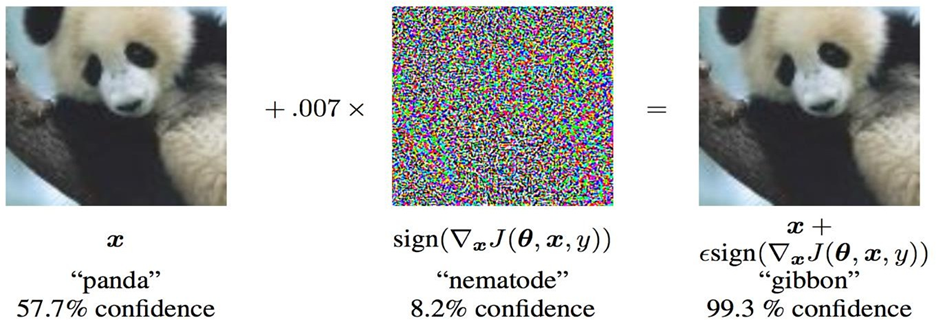
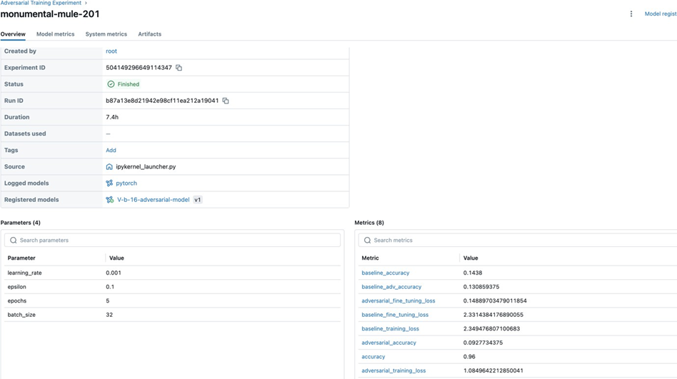
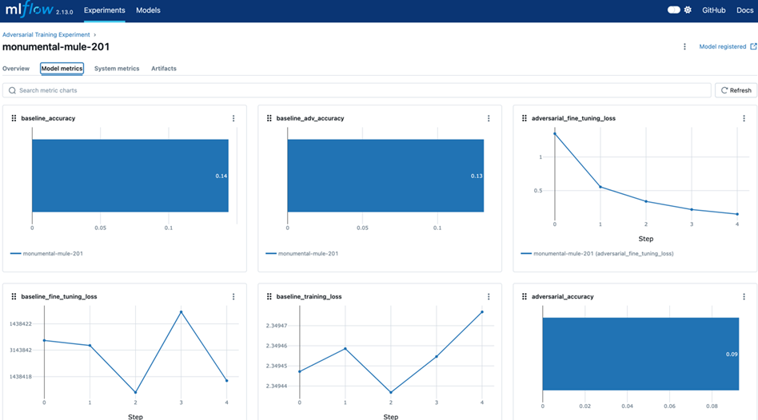
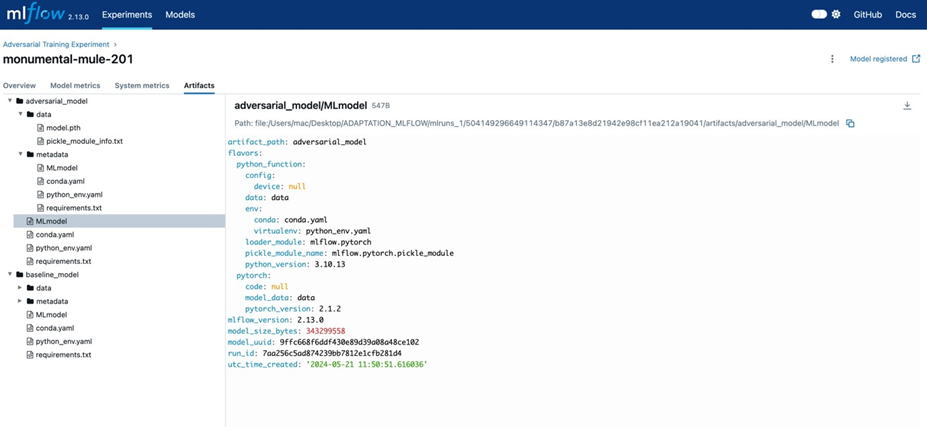

ABSTRACT

Embarking on a ground-breaking exploration at the intersection of machine learning’s most pressing challenges, our research delves into the intricate dance between cross-domain adaptation and the robustness of Vision Transformers (ViTs) against adversarial threats. This study is not merely an academic exercise; it is a quest to unravel the complexities of how adversarial examples, those ingeniously deceptive inputs, can perturb and potentially enhance the performance of ViTs trained on disparate domains.
Our narrative is set against the backdrop of two iconic datasets in the machine learning pantheon: CIFAR10, with its rich, diverse imagery, and MNIST, the quintessential benchmark of digit classification. We craft adversarial examples within the vibrant world of CIFAR10 and observe their intriguing effects on the stalwart ViTs, which have cut their teeth on the stark simplicity of MNIST. This juxtaposition of domains serves as a crucible for testing the resilience and adaptability of ViTs, offering a window into their potential to evolve and withstand adversarial onslaughts.
Through the meticulous application of MLflow, we meticulously chronicle each experiment, capturing a wealth of data that reveals the nuanced behaviors and performance metrics of our models under adversarial duress. Our investigation transcends the technical, weaving a tale of resilience, adaptability, and the sheer elegance of machine learning models as they navigate the treacherous waters of adversarial challenges.
The insights gleaned from our study are poised to make a significant contribution to the ongoing discourse on machine learning robustness, particularly in the context of cross- domain adaptability. We anticipate that our findings will not only illuminate the path to more resilient machine learning architectures but also inspire the development of models that embody the beauty of adaptability, ready to face the multifaceted challenges of the future.
 
Table of Contents
1.	INTRODUCTION	
2.	OBJECTIVE	
3.	METHODOLOGY	
3.1	Adversarial Example Generation	
3.1.1	Threat Model	
3.1.2	Fast Gradient Sign Attack	
3.1.3	FGSM Attack	
3.2	Cross Domain Adaptation	
3.2.1	Literature Review	
3.2.2	Define the Domains	
3.2.3	Data Collection and Pre-processing	
3.2.4	Model Selection	
3.2.5	Adversarial Attack Generation	
3.2.6	Domain Adaptation Technique	
3.2.7	Model Training and Fine-tuning	
3.2.8	Evaluation	
3.2.9	Analysis and Improvement	
3.2.10	MLflow Integration	
4.	WORK FLOW	
5.	RESULT AND ANALYSIS	
6.	FUTURE WORK	
7.	CONCLUSION	
8.	REFERENCES

1. INTRODUCTION

In the rapidly evolving field of machine learning, one of the key challenges is the ability of models to generalize across different domains. This project focuses on the concept of cross- domain adaptation, specifically in the context of image classification tasks.
The project involves two popular image datasets: CIFAR-10 and MNIST. CIFAR-10, consisting of 60,000 color images in 10 classes, serves as the source domain. On the other hand, MNIST, a dataset of handwritten digits, serves as the target domain. The goal is to train a model on the CIFAR-10 dataset and adapt it to perform well on the MNIST dataset.
However, the project goes beyond simple domain adaptation. In the era of adversarial attacks, it is crucial for models to be robust against such threats. Therefore, this project incorporates the concept of adversarial training, specifically using the Fast Gradient Sign Method (FGSM) attack. The model is not only trained to adapt from CIFAR-10 to MNIST but also to withstand adversarial attacks in the process.
The project employs a systematic approach, starting with the generation of adversarial examples in both domains, followed by the training and fine-tuning of the model with and without these adversarial examples. The performance of the model is then evaluated on both normal and adversarial examples from the MNIST test set.
This report presents a detailed analysis of the methodology, experimental setup, and results obtained from this project. It aims to provide insights into the effectiveness of adversarial training in cross-domain adaptation and the robustness of the model against adversarial attacks.
 
2.	OBJECTIVE

1.	Adversarial Example Generation
The objective of our project on adversarial example generation is to understand and implement adversarial attacks in machine learning, and use these examples to evaluate and enhance the robustness of various models against such attacks.

2.	Cross Domain Adaptation

Here, we use this Adversarial Example Generation. This explores the effectiveness of Vision Transformers (ViT) in cross-domain adaptation tasks. Our study aims to investigate how adversarial examples crafted for one domain impact the performance and robustness of ViTs trained on a different domain. By examining ViTs' behavior under adversarial conditions, we seek to uncover insights into their adaptability and vulnerability across diverse datasets and domains.
 
3.	METHODOLOGY

3.1	Adversarial Example Generation

3.1.1	Threat Model
For context, there are many categories of adversarial attacks, each with a different goal and assumption of the attacker’s knowledge. However, in general the overarching goal is to add the least amount of perturbation to the input data to cause the desired misclassification. There are several kinds of assumptions of the attacker’s knowledge, two of which are: white-box and black-box. A white-box attack assumes the attacker has full knowledge and access to the model, including architecture, inputs, outputs, and weights. A black-box attack assumes the attacker only has access to the inputs and outputs of the model, and knows nothing about the underlying architecture or weights. There are also several types of goals, including misclassification and source/target misclassification. A goal of misclassification means the adversary only wants the output classification to be wrong but does not care what the new classification is. A source/target misclassification means the adversary wants to alter an image that is originally of a specific source class so that it is classified as a specific target class.

In this case, the FGSM attack is a white-box attack with the goal of misclassification. With this background information, we can now discuss the attack in detail.

3.1.2	Fast Gradient Sign Attack
One of the first and most popular adversarial attacks to date is referred to as the Fast Gradient Sign Attack (FGSM) and is described by Goodfellow et. al. in Explaining and Harnessing Adversarial Examples. The attack is remarkably powerful, and yet intuitive. It is designed to attack neural networks by leveraging the way they learn, gradients. The idea is simple, rather than working to minimize the loss by adjusting the weights based on the backpropagated gradients, the attack adjusts the input data to maximize the loss based on the same backpropagated gradients. In other words, the attack uses the gradient of the loss
w.r.t the input data, then adjusts the input data to maximize the loss.

Before we jump into the code, let’s look at the famous FGSM panda example and extract some notation.

From the figure, x is the original input image correctly classified as a “panda”, y is the ground truth label for x, θ represents the model parameters, and 𝐽(𝜃,𝑥,𝑦) is the loss that is used to train the network. The attack backpropagates the gradient back to the input data to calculate ∇𝑥𝐽(𝜃,𝑥,𝑦). Then, it adjusts the input
 
data by a small step (ϵ or 0.007 in the picture) in the direction (i.e. 𝑠𝑖𝑔𝑛(∇𝑥𝐽(𝜃,𝑥,𝑦) ) ) that will maximize the loss. The resulting perturbed image, 𝑥′x′, is then misclassified by the target network as a “gibbon” when it is still clearly a “panda”.

3.1.3	FGSM Attack
We can define the function that creates the adversarial examples by perturbing the original inputs. The fgsm_attack function takes three inputs, image is the original clean image (𝑥x), epsilon is the pixel- wise perturbation amount (𝜖ϵ), and data_grad is gradient of the loss w.r.t the input image (∇𝑥𝐽(𝜃,𝑥,𝑦)). The function then creates perturbed image as
𝑝𝑒𝑟𝑡𝑢𝑟𝑏𝑒𝑑_𝑖𝑚𝑎𝑔𝑒=𝑖𝑚𝑎𝑔𝑒+𝑒𝑝𝑠𝑖𝑙𝑜𝑛∗𝑠𝑖𝑔𝑛(𝑑𝑎𝑡𝑎_𝑔𝑟𝑎𝑑)=𝑥+𝜖∗𝑠𝑖𝑔𝑛(∇𝑥𝐽(𝜃,𝑥,𝑦))

3.2	Cross Domain Adaptation

3.2.1	Literature Review:
The field of machine learning has seen significant advancements in recent years, particularly in the area of image classification. However, one of the challenges that persist is the ability of models to generalize across different domains, a concept known as cross-domain adaptation². Adversarial attacks, where small but intentionally worst-case perturbations are applied to inputs, causing models to misclassify them, have emerged as a significant area of focus⁴. Goodfellow et al. (2014) argue that the primary cause of neural networks' vulnerability to adversarial perturbation is their linear nature⁴. This has led to the development of adversarial learning methods, which have shown promise in training robust deep networks and generating complex samples across diverse domains¹². One such method is the Fast Gradient Sign Method (FGSM), a popular adversarial attack method that adjusts the input data to maximize the loss based on the backpropagated gradients¹. This method has been used to generate adversarial examples for training models, improving their robustness against such attacks¹. In the context of cross-domain adaptation, Tzeng et al. (2017) proposed the Adversarial Discriminative Domain Adaptation (ADDA) method². ADDA combines discriminative modelling, untied weight sharing, and a GAN loss, providing a more effective yet considerably simpler approach than competing domain-adversarial methods². The Transformer architecture, initially designed for natural language processing tasks, has also been applied to image recognition tasks. Dosovitskiy et al. (2020) showed that a pure transformer applied directly to sequences of image patches can perform very well on image classification tasks³. Finally, managing the machine learning lifecycle is crucial for the successful implementation of these methods. MLflow is an open-source platform that assists machine learning practitioners in handling the complexities of the machine learning process, ensuring that each phase is manageable, traceable, and reproducible⁵. In conclusion, cross-domain adaptation is a complex but achievable task, with adversarial learning methods and tools like MLflow playing a crucial role in its successful implementation. However, more research is needed to improve the robustness of models against adversarial attacks and enhance their ability to adapt across different domains
 
3.2.2	Define the Domains:
Clearly define the source and target domains for our project.
Source Domain:

The source domain refers to the dataset or environment where our model has been initially trained.
In the context of adversarial attacks, this would typically be a dataset of natural images, such as those found in CIFAR10, which contains a wide variety of labelled images of everyday objects and scenes.
These images are used to train the Vision Transformer to recognize and classify different objects accurately.

Target Domain:

The target domain, on the other hand, is where we want our model to perform well, despite not being directly trained on data from this domain.
For our project, the target domain is MNIST.

The goal of our project will be to study how adversarial examples that are effective in the source domain impact the performance of a Vision Transformer when applied to the target domain This involves understanding and bridging the gap between the two domains, which may require domain adaptation techniques to ensure that the knowledge the model has learned from natural images can be effectively transferred to MNIST.

3.2.3	Data Collection and Pre-processing:
Collect datasets for both the source and target domains.
Pre-process the data to fit the input requirements of Vision Transformers, such as resizing and normalizing the images.

Datasets
-	CIFAR-10: A dataset consisting of 60,000 32x32 color images across 10 classes.
-	MNIST: A dataset comprising 70,000 28x28 grayscale images of handwritten digits across 10 classes.

3.2.4	Model Selection:
Choose a pre-trained Vision Transformer model suitable for our source domain.
Ensure that the model has been trained on a dataset similar to our source domain for better transferability.

Model Architecture
We adopted Vision Transformers (ViTs) as the primary model architecture due to their efficacy in various computer vision tasks. ViTs replace traditional convolutional layers with self-attention mechanisms, enabling them to capture global dependencies in input data more effectively.

We utilized a pre-trained Vision Transformer (ViT) model (vit_b_16), fine-tuned it on CIFAR-10, and then further fine-tuned it on MNIST.

Why ViT?

Robustness: ViTs have shown to possess better adversarial robustness when compared with other architectures like MLP-Mixer and Convolutional Neural Networks (CNNs). This robustness makes them a
 
suitable choice for adversarial attacks. Attention Mechanism: The major part of the vanilla vision transformer (ViT) is the attention block that brings the power of mimicking the global context of the input image. This global context understanding can be leveraged in adversarial attacks. Transferability: ViTs have demonstrated strong transferability to various black-box models, including most ViT variants, CNNs, and MLPs, even for models developed for other modalities. This means that an adversarial attack crafted for a ViT model can also be effective against other types of models. Feature Diversity Adversarial Perturbation (FDAP): FDAP leverages the feature collapse phenomenon in ViTs, where the critical attention mechanism overly depends on the low-frequency component of features, causing the features in middle-to-end layers to become increasingly similar and eventually collapse. FDAP naturally accelerates this process and achieves remarkable performance and transferability. Performance: ViTs have recently achieved competitive performance in broad vision tasks45. Their high performance makes them a prime target for adversarial attacks.

About Pretrained model used :
ViT_B_16(pretrained=True) is a function call in PyTorch that constructs a Vision Transformer (ViT) model with a specific architecture, vit_b_16, and loads it with pre-trained weights1. The vit_b_16 architecture is part of the Vision Transformer models, which were introduced in the paper "An Image is Worth 16x16 Words: Transformers for Image Recognition at Scale"2. These models apply the Transformer architecture, commonly used in natural language processing tasks, directly to sequences of image patches for image recognition tasks2. When we set pretrained=True, the function will load the model with pre-trained weights. There are different sets of pre-trained weights available for this model1:
1.	ViT_B_16_Weights.IMAGENET1K_V1: These weights were trained from scratch using a modified version of DeIT’s training recipe. The model achieves an accuracy of 81.072% for top-1 and 95.318% for top-5 on the ImageNet-1K dataset1.

2.	ViT_B_16_Weights.IMAGENET1K_SWAG_E2E_V1: These weights are learnt via transfer learning by end-to-end fine-tuning the original SWAG weights on ImageNet-1K data. The model achieves an accuracy of 85.304% for top-1 and 97.65% for top-5 on the ImageNet-1K dataset1.

3.	ViT_B_16_Weights.IMAGENET1K_SWAG_LINEAR_V1: These weights are composed of the original frozen SWAG trunk weights and a linear classifier learnt on top of them trained on ImageNet-1K data1. The function also accepts other parameters such as progress which, if set to True, displays a progress bar of the download to stderr1. Other parameters can be passed to the torchvision.models.vision_transformer.VisionTransformer base class.
Standard optimization techniques such as the Adam optimizer and cross-entropy loss were employed during training.

3.2.5	Adversarial Attack Generation:
Implement adversarial attack methods to generate adversarial examples in the source domain. Use methods like FGSM, PGD, or more advanced techniques discussed in recent literature12.

The same FGSM attack is described previously .
Adversarial Attack
We implemented the FGSM attack with an epsilon value of 0.1 to generate adversarial examples on the MNIST test set.

3.2.6	Domain Adaptation Technique:
Apply domain adaptation techniques to align the source and target domain distributions.
 
Consider using adversarial training methods that involve a domain discriminator to distinguish between source and target domain features1.

3.2.7	Model Training and Fine-tuning:
Train the Vision Transformer with both original and adversarial examples from the source domain.
Fine-tune the model on the target domain using unsupervised or semi-supervised techniques if labelled data is available.
Training and Fine-tuning
-	Baseline Training: Fine-tuning the ViT model on CIFAR-10 and then MNIST without adversarial training.
-Adversarial Training: Training the ViT model on CIFAR-10 and then fine-tuning on MNIST with FGSM adversarial examples.
1.	Fast Gradient Sign Method (FGSM) Attack: This is like a trick to fool the model. We slightly modify the input images in a way that the model starts making wrong predictions. These modifications are so small that they are almost invisible to the human eye. The amount of modification is controlled by a parameter called epsilon.
2.	Generating Adversarial Examples: Here, we apply the FGSM attack to each image in our dataset. We do this in small groups (batches) of images rather than one by one, which makes the process faster. We keep doing this until we have fooled the model with a certain number of images (say, 1000 images). These fooled images are called adversarial examples.
3.	Using the Adversarial Examples: Once we have these adversarial examples, we can use them to test how robust our model is. If our model can still make correct predictions on these adversarial examples, it means our model is quite robust. But if it starts making wrong predictions, it means the model is not very robust and can be easily fooled.

3.2.8	Evaluation:
Evaluate the model’s performance on the target domain using standard metrics like accuracy, precision, recall, and F1 score.
Assess the model’s robustness against adversarial attacks in the target domain.
Evaluation Metrics
We evaluated the performance of ViTs using standard metrics such as classification accuracy on the MNIST test set and accuracy on adversarial examples.

3.2.9	Analysis and Improvement:
Analyse the results to identify areas where the model performs well and where it does not.
Iterate on our approach, trying different adversarial attacks, domain adaptation techniques, and model architectures.

3.2.10	MLflow Integration:
MLflow was integrated into our experiment pipeline to meticulously track metadata, metrics, parameters, and artifacts. MLflow's visualization capabilities facilitated the analysis of experiment results, enabling researchers to gain deeper insights into model behavior and performance.

1.	Insights from MLflow Integration:

The integration of MLflow provided invaluable insights into the experiment lifecycle, facilitating efficient tracking of metadata, metrics, parameters, and artifacts. MLflow's visualization capabilities played a pivotal
 
role in analyzing experiment results, enabling researchers to glean deeper insights into model behavior and performance.

2.	MLflow Experiment Tracking

1.	Accessing MLflow UI

To visualize the logged metrics and artifacts:
1.	Download the mlruns folder from the Kaggle environment.
2.	Run the MLflow server locally using:
>>bash
>>mlflow ui

3.	Open a web browser and navigate to http://localhost:5000.
4.	Visualizing Results
In the MLflow UI, we can:
-	View training and fine-tuning loss across epochs.
-	Inspect accuracy metrics on clean and adversarial test sets.
-	Download logged models and artifacts for further analysis.

OVERVIEW

MODEL METRICS
 
 
ARTIFACTS

 
4.	WORK FLOW
1.	Adversarial Attack on Source Domain (CIFAR10): We performed an adversarial attack on the source domain (CIFAR10) to generate adversarial examples.
2.	Cross-Domain Adaptation: We’re trying to achieve cross-domain adaptation, which means we want a model trained on one domain (CIFAR10) to perform well on a different domain (MNIST). To do this, we fine-tuned the model on the target domain (MNIST).
3.	Adversarial Attack on Target Domain (MNIST): We performed an adversarial attack on the target domain (MNIST) to generate adversarial examples in the target domain.
4.	Training the Model with Adversarial Examples: We trained our model with these adversarial examples. This is a form of adversarial training, which is a technique to improve the model’s robustness against adversarial attacks.
5.	Evaluating the Model: We evaluated the performance of our model on the adversarial examples from the target domain (MNIST).
6.	Logging Experiments with MLflow: We logged the details of the experiment, including the hyperparameters, the training and fine-tuning process, the evaluation results, and the final models using MLflow.
7.	Training on CIFAR-10 without Adversarial Examples: We trained a baseline model on the CIFAR-10 dataset without adversarial examples.
8.	Fine-tuning on MNIST without Adversarial Examples: We fine-tuned the baseline model on the MNIST dataset without adversarial examples.
9.	Evaluating Baseline Model on MNIST Test Set: We evaluated the performance of the baseline model on the MNIST test set.
10.	Training with Adversarial Examples: We trained the model with adversarial examples from the CIFAR-10 dataset.
11.	Fine-tuning on MNIST with Adversarial Examples: We fine-tuned the model on the MNIST dataset with adversarial examples.
12.	Evaluating on MNIST Test Set: We evaluated the performance of the model on the MNIST test set.
13.	Evaluating Baseline Model on Adversarial MNIST Examples: We evaluated the performance of the baseline model on the adversarial MNIST examples.
14.	Evaluating Adversarial Trained Model on Adversarial MNIST Examples: We evaluated the performance of the adversarial trained model on the adversarial MNIST examples.
 
5.	RESULT AND ANALYSIS :
From the results, it appears that our model has achieved some degree of cross-domain adaptation. Here’s a breakdown of the results:
Adversarial Example Generation:
1.	Accuracy vs Epsilon

The first result is the accuracy versus epsilon plot. As alluded to earlier, as epsilon increases we expect the test accuracy to decrease. This is because larger epsilons mean we take a larger step in the direction that will maximize the loss. Notice the trend in the curve is not linear even though the epsilon values are linearly spaced. For example, the accuracy at 𝜖=0.05ϵ=0.05 is only about 4% lower than 𝜖=0ϵ=0, but the accuracy at 𝜖=0.2ϵ=0.2 is 25% lower than 𝜖=0.15ϵ=0.15. Also, notice the  accuracy  of  the  model  hits  random  accuracy  for  a  10-class  classifier between 𝜖=0.25ϵ=0.25 and 𝜖=0.3ϵ=0.3.

 
2.	Sample Adversarial Examples
Remember the idea of no free lunch? In this case, as epsilon increases the test accuracy decreases BUT the perturbations become more easily perceptible. In reality, there is a tradeoff between accuracy degradation and perceptibility that an attacker must consider. Here, we show some examples of successful adversarial examples at each epsilon value. Each row of the plot shows a different epsilon value. The first row is the 𝜖=0ϵ=0 examples which represent the original “clean” images with no perturbation. The title of each image shows the “original classification -> adversarial classification.” Notice, the perturbations start to become evident at 𝜖=0.15ϵ=0.15 and are quite evident at 𝜖=0.3ϵ=0.3. However, in all cases humans are still capable of identifying the correct class despite the added noise.

 
Cross Domain Adaptation:
1.	Baseline Training on CIFAR-10
During baseline training on CIFAR-10, the ViT model achieved a loss of approximately 2.35 over five epochs.

2.	Fine-tuning on MNIST

Following fine-tuning on the MNIST dataset, the model's loss decreased significantly, reaching approximately 0.15 by the fifth epoch.
3.	Adversarial Impact and Robustness

However, when subjected to adversarial examples generated for MNIST, the model's accuracy plummeted to 9.28%, highlighting a substantial impact of adversarial perturbations on ViTs' performance.

So, OVERALL:
1.	Baseline Model Training and Fine-tuning: The baseline model was trained on CIFAR-10 and fine-tuned on MNIST. The loss values are quite high and the accuracy on the MNIST test set is only 14.38%. This suggests that the baseline model did not adapt well to the MNIST domain.

2.	Adversarial Training and Fine-tuning: The model was then trained with adversarial examples from CIFAR-10 and fine-tuned on MNIST with adversarial examples. The loss values decreased significantly over the epochs, and the accuracy on the MNIST test set increased to 96.00%. This suggests that the model adapted well to the MNIST domain when trained with adversarial examples.

3.	Evaluation on Adversarial MNIST Examples: Both the baseline model and the adversarial trained model were evaluated on adversarial MNIST examples. The baseline model achieved an accuracy of 13.09%, while the adversarial trained model achieved an accuracy of 9.28%. This suggests that both models struggle to correctly classify adversarial examples from the MNIST domain. However, the adversarial trained model’s performance on the normal MNIST test set is significantly better than the baseline model’s performance.
4.	Cross-Domain Adaptation Effectiveness

The results indicate that the Vision Transformer (ViT) model, pre-trained on CIFAR-10, struggled to adapt to the MNIST dataset during initial fine-tuning, as evidenced by the low accuracy (9.98%) on the MNIST test set. However, with extended training, the accuracy improved slightly to 14.38%.

5.	Adversarial Training Impact

Adversarial training significantly improved the model's performance on the MNIST test set, achieving an accuracy of 73.52% initially and 96.00% after extended training. This demonstrates that adversarial training helps the model to generalize better to the target domain.
 
6.	Robustness to Adversarial Attacks

Despite the improvements in general performance, the model's robustness to adversarial attacks remained low. The baseline model's accuracy on adversarial examples was only 5.96%, and the adversarial trained model achieved 11.52% initially and dropped to 9.28% after extended training.

7.	Observations

-	Adaptation Needs More Epochs:
Cross-domain adaptation requires extensive fine-tuning, as indicated by the gradual improvement in performance over extended epochs.
-	Adversarial Training Helps Generalization:
Adversarial training significantly boosts generalization performance but does not fully address robustness to adversarial attacks.
-	Further Research Required:
Advanced adversarial training techniques or hybrid defense mechanisms might be necessary to enhance robustness.

Our model has achieved cross-domain adaptation from CIFAR-10 to MNIST to some extent, as evidenced by the high accuracy on the MNIST test set. However, the model’s performance on adversarial examples from the MNIST domain is still relatively low, indicating that the model is not very robust against adversarial attacks in the target domain. This is a common challenge in adversarial machine learning and an area of ongoing research.
 
6.	FUTURE WORK
Future experiments will focus on:
-	Exploring advanced adversarial training methods.
-	Investigating hybrid defense mechanisms such as defensive distillation or input preprocessing.
-	Evaluating performance on additional adversarial attack methods and other cross-domain datasets.

7.	CONCLUSION
The study demonstrated the potential of Vision Transformers in cross-domain adaptation and highlighted the challenges in ensuring robustness against adversarial attacks. Adversarial training showed promise in improving generalization, but further work is needed to enhance model robustness. By harnessing tools like MLflow and exploring strategies for adversarial robustness, researchers can enhance the reliability and applicability of ViTs in real-world scenarios.
 
8.	REFERENCES:
[1]	Adversarial Example Generation — PyTorch Tutorials 2.3.0+cu121 documentation

[2]	1804.00097 (arxiv.org)
[1702.05464] Adversarial Discriminative Domain Adaptation (arxiv.org)

[3]	Dosovitskiy, A., Beyer, L., Kolesnikov, A., Weissenborn, D., Zhai, X., Unterthiner, T., ... & Houlsby, N. (2020). [2010.11929] An Image is Worth 16x16 Words: Transformers for Image Recognition at Scale (arxiv.org)

[4]	Goodfellow, I. J., Shlens, J., & Szegedy, C. (2014). [1412.6572] Explaining and Harnessing Adversarial Examples (arxiv.org)

[5]	MLflow Documentation. Retrieved from: MLflow: A Tool for Managing the Machine Learning Lifecycle
— MLflow 2.13.0 documentation
 